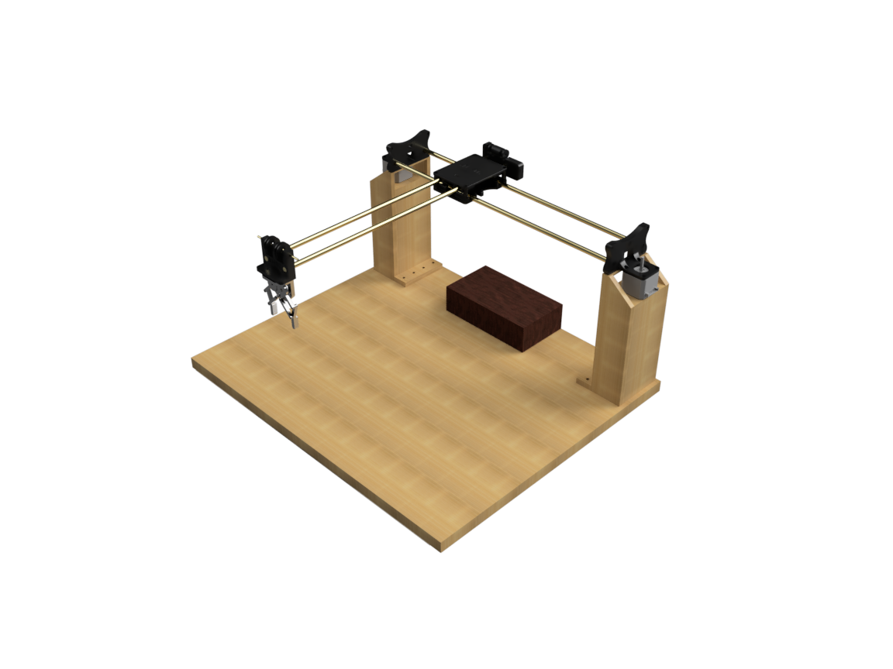
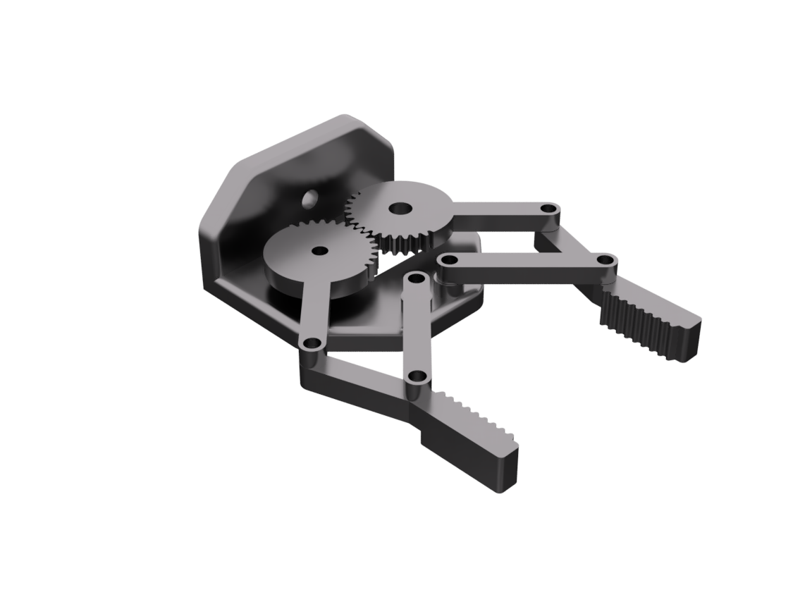
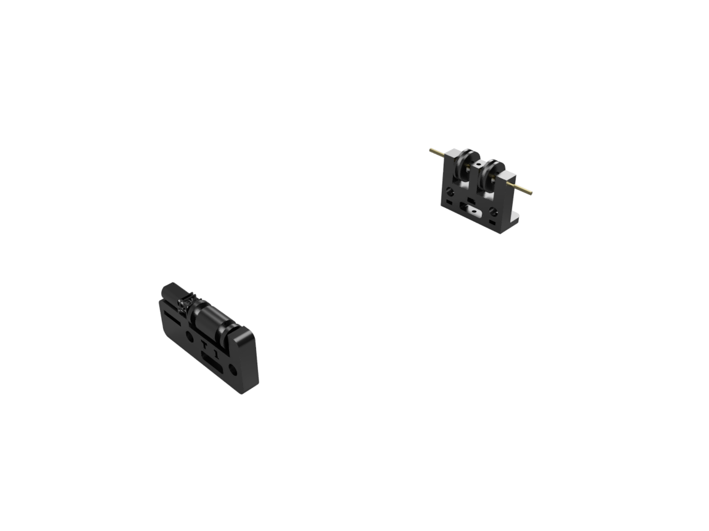
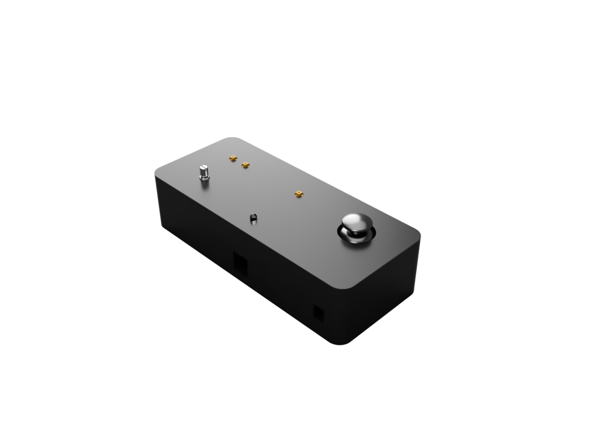
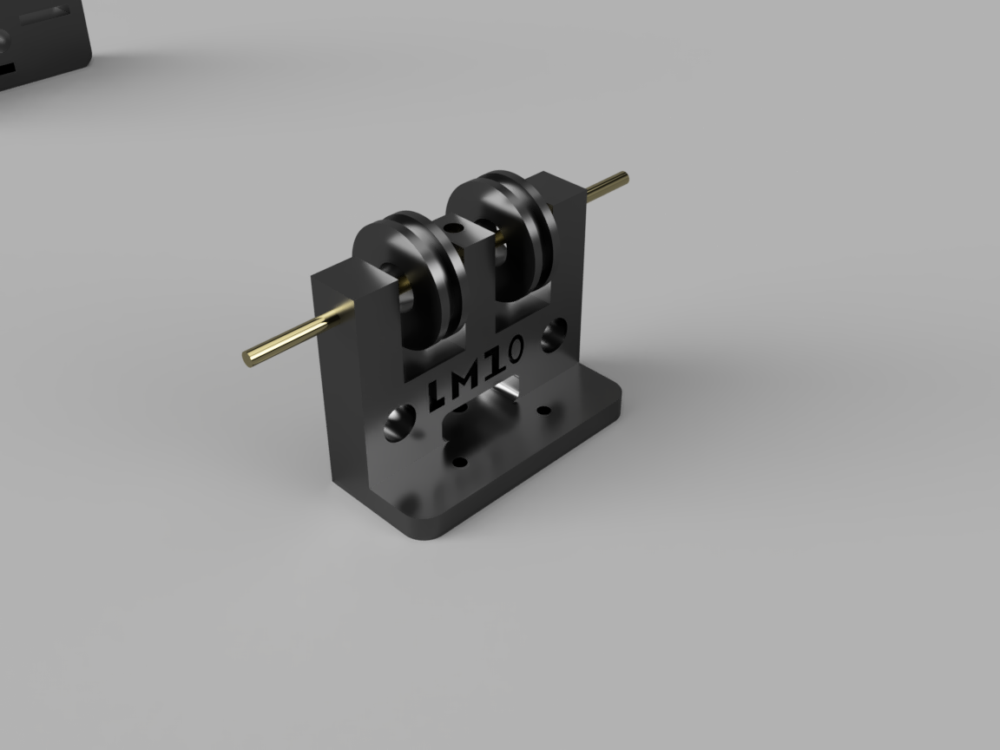
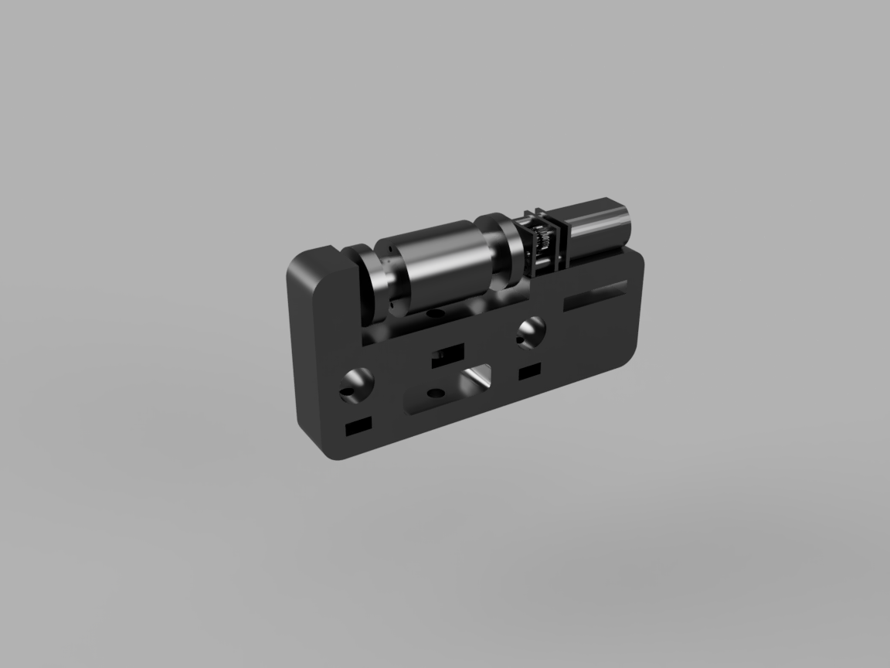
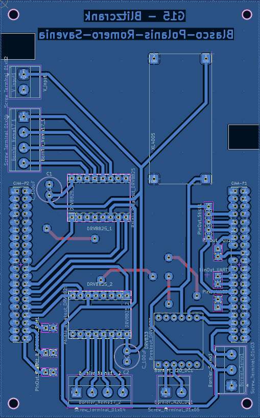
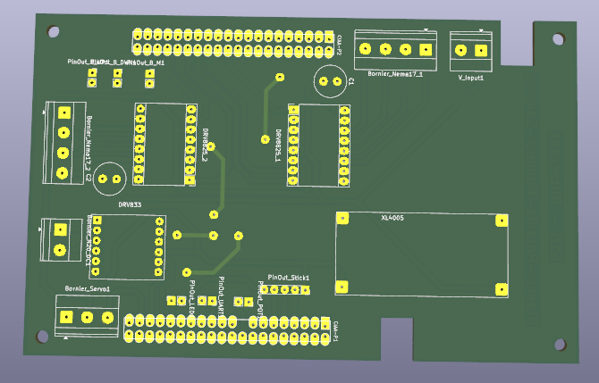

# Blitzcrank

<p align="center">
  <a href="README.md"></a>
  <a href="README.en.md"></a>
</p>

## Descripción del proyecto

El proyecto **Blitzcrank** es un prototipo de **garra robótica móvil** diseñado para desplazarse en dos ejes (X e Y) mediante un sistema de rieles. Sobre este plano de movimiento, la garra puede **subir, bajar, abrir y cerrar**, lo que le otorga la capacidad de manipular objetos livianos dentro de un área determinada. El control se realiza manualmente a través de un **joystick de efecto Hall** y un conjunto de botones que permiten al usuario interactuar de manera sencilla e intuitiva.

Más allá de su valor como ejercicio técnico, el prototipo puede servir como base para múltiples aplicaciones: desde la simulación de procesos de **transporte y manipulación de piezas** hasta escenarios lúdicos como las clásicas máquinas de garras o sistemas recreativos de precisión, por ejemplo, un robot capaz de jugar al ajedrez moviendo las piezas en el tablero. De esta manera, Blitzcrank demuestra cómo la **tecnología robótica** puede adaptarse tanto a la **experimentación educativa** como a la **innovación aplicada** en proyectos más complejos.


<details>
  <summary><i>Objetivos del proyecto</i></summary>

  - **Objetivos primarios:**

    Se detallan a continuación aquellos objetivos de carácter obligatorio, necesarios para la validación del proyecto.

    - Implementar un sistema de rieles que permita el desplazamiento de la garra en los ejes X e Y.
    - Incorporar un mecanismo que posibilite el movimiento vertical de la garra para subir y bajar.
    - Desarrollar un sistema de control manual que garantice un manejo sencillo e intuitivo.
    - Integrar un actuador que permita abrir y cerrar la garra para tomar y soltar objetos.

  - **Objetivos secundarios:**

    A continuación se detallan aquellos objetivos de carácter opcional, sujetos a tiempo, materiales y costos disponibles.

    - Adaptar el sistema para manipular piezas de ajedrez en un tablero, garantizando precisión en la colocación.
    - Implementar un módulo de visión artificial que permita identificar la posición de las piezas en el tablero.
    - Integrar un algoritmo de inteligencia artificial que tome decisiones de juego y guíe automáticamente los movimientos de la garra.
    - Implementar una interfaz web que permita el manejo de la garra.

</details>

<details>
  <summary><i>Requerimientos del proyecto</i></summary>

  ##### Requerimientos Funcionales

  - **Requerimientos de Hardware:**

    - Debe contar con una interfaz física para mover la garra.
      - El sistema debe incluir unos botones dedicados al ascenso y descenso de la garra.
      - El sistema debe incluir un potenciómetro dedicado a la apertura y cierre de la garra.
      - El sistema debe incorporar un controlador para manejar los movimientos de la garra en los ejes X e Y.
      - El sistema debe incorporar un botón para manejar el cambio de modo físico y remoto.
    - Movimiento preciso de la garra.
      - El sistema de rieles debe permitir el movimiento de la garra en dos ejes cartesianos (X e Y), con un área mínima de trabajo de 15 cm x 15 cm.
      - El eje Z debe recorrer verticalmente al menos 5 cm para tomar y elevar piezas.
      - Se deben utilizar motores paso a paso para garantizar la posición exacta de la garra.
      - La garra debe ser capaz de levantar objetos de 50 gramos.
    - Todos los componentes deben estar ensamblados con fines de obtener un único sistema final compacto.

  - **Requerimientos de Software:**

    - Se debe desarrollar una interfaz de usuario capaz de controlar el sistema.
      - Desarrollar una interfaz que permita controlar manualmente la garra.
      - Implementar una interfaz web que permita seleccionar el modo de operación.
      - La interfaz debe ser intuitiva y clara, mostrando el estado del sistema y los errores en caso de que ocurran.
    - El software debe gestionar los límites de movimiento, deteniendo la garra para evitar daños mecánicos.

  ##### Requerimientos no funcionales

  Estos requerimientos no afectan en la funcionalidad del proyecto, por lo cual no se ve necesidad de hacer particular énfasis en la validación, pero que sí han sido tenidos en cuenta en el desarrollo.

  - Plataforma y desarrollo.
    - Utilizar una placa EDU-CIAA-NXP como centro de control del sistema, basada en el microcontrolador NXP LPC 4337.
    - Todo el firmware del EDU-CIAA debe ser desarrollado en lenguaje C.
  - Tiempo de ejecución: 16 semanas.
  - Presupuesto total de 600.000 ARS.
  - Documentación.
    - Documentar detalladamente el proceso de ensamblado del sistema.
    - Documentar el desarrollo del firmware, incluyendo rutinas de control e inicialización.
    - Documentar el diseño del esquemático y PCB, incluyendo conexiones, componentes y disposición de pines.
  - Garantizar la seguridad del usuario durante la operación del sistema, incluyendo protecciones físicas.

</details>

<details>
  <summary><i>Tecnologías utilizadas</i></summary>
  <ol>

  <li>Hardware</li>
    <ul>
      <li>EDU-CIAA-NXP (LPC4337): placa central de control del sistema</li>
      <li>ESP-WROOM-32: módulo Wi-Fi para control remoto e interfaz web</li>
      <li>Motores paso a paso Nema17: movimiento en ejes X e Y</li>
      <li>Drivers DRV8825: control de motores paso a paso</li>
      <li>Motor DC GA12N20 + Driver DRV8833: accionamiento de polea</li>
      <li>Servomotor TowerPro MG90s: apertura y cierre de la garra</li>
      <li>Joystick analógico SYSPORT: control de movimiento X-Y</li>
      <li>Potenciómetro 10k: control analógico de la garra</li>
      <li>Fuente 12V 5A + Step Down XL4005: alimentación del sistema</li>
    </ul>

  <li>Firmware</li>
    <ul>
      <li>Lenguaje C para el firmware de la EDU-CIAA-NXP</li>
      <li>C++ con Arduino Framework para el firmware del ESP32</li>
      <li>PlatformIO como entorno de desarrollo del ESP32</li>
      <li>Comunicación UART entre EDU-CIAA y ESP32</li>
    </ul>

  <li>Interfaz web (ESP32)</li>
    <ul>
      <li>HTML, CSS y JavaScript servidos desde SPIFFS</li>
      <li>ESPAsyncWebServer para el servidor web embebido</li>
      <li>WebSockets para comunicación en tiempo real</li>
    </ul>

  <li>Diseño y fabricación</li>
    <ul>
      <li><a href="https://www.kicad.org/">KiCad</a>: diseño de esquemáticos y PCB</li>
      <li><a href="https://www.autodesk.com/products/fusion-360/overview">Fusion 360</a>: modelado 3D de estructura y garra</li>
      <li><a href="https://ultimaker.com/es/software/ultimaker-cura/">UltiMaker Cura</a>: preparación de piezas para impresión 3D</li>
    </ul>

  </ol>
</details>

---


## Materiales

| Componente | Cantidad | Función |
| ---------- | -------- | ------- |
| EDU-CIAA-NXP | 1 | Placa central que coordina motores, sensores y comunicación |
| ESP-WROOM-32 38 PINES | 1 | Control inalámbrico mediante Wi-Fi, interfaz web remota |
| Potenciómetro 10k Lineal 16mm | 1 | Entrada analógica para apertura de garra |
| Push Button Tact Switch 6x6mm | 3 | Entrada digital para abrir/cerrar garra |
| Joystick analógico SYSPORT | 1 | Control principal en ejes X e Y con pulsador integrado |
| Motor DC GA12N20 | 1 | Motorreductor para accionar polea |
| Driver Motor DC Puente H DRV8833 | 1 | Control de motor DC, inversión de giro y regulación por PWM |
| Servomotor TowerPro MG90s | 1 | Apertura y cierre de la garra |
| Motor paso a paso Nema17 17HS3404N | 2 | Movimiento de ejes X-Y |
| Driver DRV8825 | 2 | Controlador de motores paso a paso |
| Fuente de 12V 5A SIMALED LCS-1721-M1 | 1 | Fuente de alimentación externa para todo el sistema |
| Módulo Step Down XL4005 | 1 | Transformador de tensión |

---

## Diseño 3D

<details>
  <summary>Sistema completo</summary>
  <p align="center">
    
  </p>
</details>

<details>
  <summary>Garra</summary>
  <p align="center">
    
  </p>
</details>

<details>
  <summary>Sistema de poleas</summary>
  <p align="center">
    
  </p>
</details>

<details>
  <summary>Controlador</summary>
  <p align="center">
    
  </p>
</details>

<details>
  <summary>Eje Y</summary>
  <p align="center">
    
    
  </p>
</details>

---

## PCB

<details>
  <summary>Diseño del PCB</summary>
  <p align="center">
    
  </p>
</details>

<details>
  <summary>PCB 3D</summary>
  <p align="center">
    
  </p>
</details>

---

## Estructura del Proyecto


```
Blitzcrank/
│
├── build/                        # Archivos de compilación
├── docs/                         # Documentación y diagramas del proyecto
├── firmware/                     # Directorio principal del firmware
│   ├── mainboard/                # Firmware del controlador principal (LPC4337)
│   │   ├── .settings/            # Configuración del entorno de desarrollo
│   │   ├── app/                  # Aplicación principal del firmware
│   │   │   ├── drivers/          # Drivers de hardware (UART, SPI, I2C, GPIO, etc.)
│   │   │   ├── inc/              # Archivos de encabezado propios del proyecto
│   │   │   ├── out/              # Archivos de salida (build temporal, objetos, etc.)
│   │   │   └── src/              # Código fuente de la aplicación
│   │   │       └── main.c        # Punto de entrada del firmware
│   │   │
│   │   ├── examples/             # Ejemplos de uso de las distintas librerías
│   │   ├── libs/                 # Librerías externas o módulos reutilizables
│   │   ├── scripts/              # Scripts auxiliares para automatizar tareas del proyecto
│   │   ├── test/                 # Código de pruebas del hardware y validación de módulos
│   │   ├── .cproject             # Configuración del compilador (Eclipse)
│   │   ├── .gitignore            # Archivos ignorados por Git
│   │   ├── .project              # Configuración del proyecto (Eclipse)
│   │   ├── .travis.yml           # Integración continua (Travis CI)
│   │   ├── board.mk              # Configuración específica de la placa (paths, flags, etc.)
│   │   ├── LICENSE               # Licencia del proyecto
│   │   ├── Makefile              # Archivo principal de construcción del proyecto
│   │   ├── program.mk            # Reglas de programación/flasheo del firmware
│   │   ├── README.md             # Documentación general del firmware principal
│   │
│   └── esp-32/                   # Firmware del módulo ESP32
│       ├── src/                  # Código fuente principal (main.cpp)
│       │
│       ├── lib/                  # Librerías locales del proyecto
│       │   ├── WiFiManager/      # Manejo de conexión Wi-Fi y modo AP
│       │   ├── SpiffsManager/    # Gestión del sistema de archivos SPIFFS (lectura/escritura)
│       │   ├── Routes/           # Ruteo de peticiones HTTP y manejo del servidor web
│       │   └── UARTManager/      # Comunicación serial UART y sincronización de datos con la web
│       │
│       ├── data/                 # Archivos de la interfaz web que se suben al SPIFFS
│       │   ├── index.html
│       │   ├── style.css
│       │   └── script.js
│       │
│       ├── include/  
│       ├── lib/                  # Librerías externas (ESPAsyncWebServer, etc.)
│       ├── platformio.ini        # Configuración de PlatformIO
│       └── test/                 # Pruebas específicas del ESP
│
├── hardware/                     # Diseños de PCB, Esquemáticos, Diseños 3D
│   ├── pcb/                      # Diseños de PCB
│   ├── 3d-design/                # Diseños 3D
│   └── schematic/                # Circuitos esquemáticos
│
├── resources/                    # Documentación técnica y de apoyo
│   ├── 3d-design/                # Imágenes de los diseños 3D
│   ├── datasheets/               # Datasheets de los componentes utilizados
│   ├── manuals/                  # Manuales de módulos, sensores, devkits, etc.
│   ├── notes/                    # Apuntes técnicos, application notes, cálculos útiles
│   └── schematics/               # Esquemas de conexión, wiring y diagramas eléctricos
│
├── .clang-format                 # Configuración de estilo de código
├── .gitignore                    # Archivos ignorados por Git
├── LICENSE                       # Licencia del proyecto
├── README.md                     # Archivo actual
└── STYLE_GUIDE.md                # Convenciones de estilo del proyecto
```

Para ver las convenciones de nombres y estilo de código, consultar [STYLE_GUIDE.md](./STYLE_GUIDE.md)


---

## Flujo de funcionamiento del sistema

<p align="center">
  <a href="https://www.youtube.com/@BlitzcrankG15">
    
  </a>
</p>

<p align="center">
  <a href="https://www.youtube.com/watch?v=uDqSojhFeGg">
    
  </a>
  <a href="https://www.youtube.com/watch?v=HAsxXd6xPtw">
    
  </a>
</p>


---

## Autores

<ul>
  <li>
    <a href="https://www.linkedin.com/in/gonblas/">
      
    </a>
    <a href="https://github.com/gonblas">
      
    </a>
    <strong>Blasco, Gonzalo</strong>
    <br clear="right"/>
  </li>


  <li>
    <a href="https://www.linkedin.com/in/ivanpolanis/">
      
    </a>
    <a href="https://github.com/ivanpolanis">
      
    </a>
    <strong>Polanis, Iván Valentín</strong>
    <br clear="right"/>
  </li>

  <li>
    <a href="https://www.linkedin.com/in/mateo-romero-dev/">
      
    </a>
    <a href="https://github.com/mateoromero-dev">
      
    </a>
    <strong>Romero, Mateo</strong>
    <br clear="right"/>
  </li>

  <li>
    <a href="https://www.linkedin.com/in/manuel-savenia-b38639363/">
      
    </a>
    <a href="https://github.com/manuSavenia">
      
    </a>
    <strong>Savenia, Manuel</strong>
    <br clear="right"/>
  </li>
</ul>

## Coordinador

<ul>
  <li>
    <a href="https://www.linkedin.com/in/joaquín-chanquía-a747a1291/">
      
    </a>
    <a href="https://github.com/joacochanquia">
      
    </a>
    <strong>Joaquín Chanquía</strong><br />
    <em>Ayudante – Taller de Proyecto I</em>
    <br clear="right"/>
  </li>
</ul>

---

## Licencia

Este proyecto se distribuye bajo la licencia [GPL](LICENSE).
